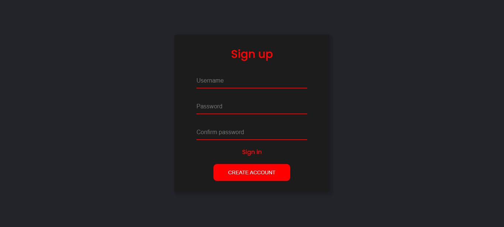

 <h1> Formulário </h1>

 
   
  <h2><a href="https://rodriguesgs.github.io/Pomodoro-Timer/" target="_blank">Live demo</a></h2>

---

Este é um simples formulário

## Tecnologias utilizadas

* [HTML](https://developer.mozilla.org/pt-BR/docs/Web/HTML)
* [CSS](https://developer.mozilla.org/pt-BR/docs/Web/CSS)
* [JavaScript](https://developer.mozilla.org/pt-BR/docs/Web/JavaScript)

---

Pretendo num futuro vir e refazer esse formulário pois o que eu queria fazer ainda não obtive o conhecimento necessário, mas gostei bastante do resultado final, porém, ainda há muitas coisas para serem consertadas
